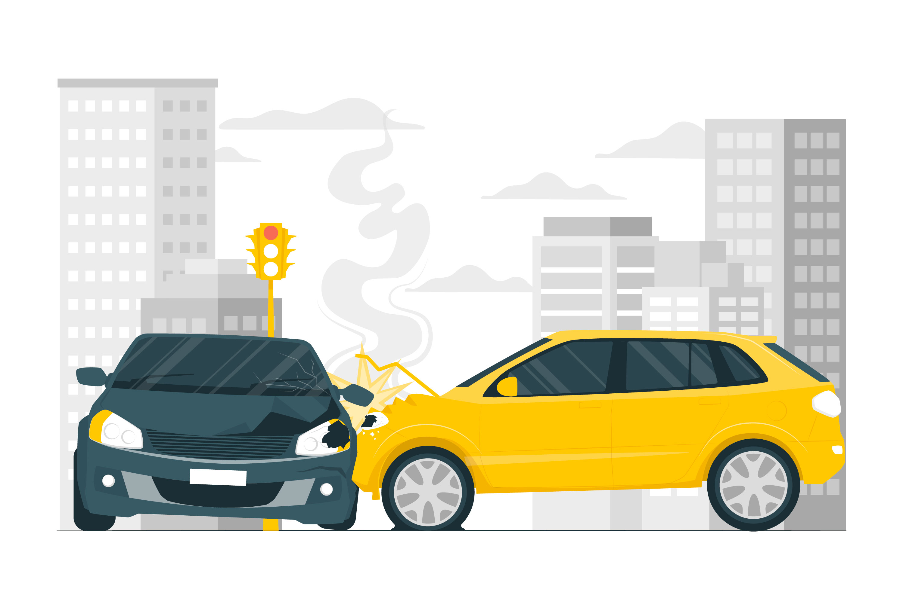

# NYC-Collision-Analysis

## Introduction:

Motor vehicle collisions are a major public safety concern in urban areas, often resulting in injuries, fatalities, property damage, and traffic disruptions. In a densely populated and high-traffic city like New York, understanding the patterns and causes of car collisions is essential for improving road safety and reducing accident rates.

This analysis focuses on car collisions reported by the New York City Police Department between January and August 2020. The dataset includes detailed information on each incident, such as the time, location, contributing factors, and the types of vehicles and victims involved. By analyzing this data, the goal is to uncover trends related to when and where collisions occur most frequently, identify high-risk areas and behaviors, and provide actionable insights that can support city planning, policy-making, and public safety efforts.

## Key metrics:

1. What is the total collisions?
2. When do accidents occur most frequently?
3. Which street were most accident reported from?
4. What is the most contributing factor of the accidents reported?

## Skills:

The following Power BI feautures were incorporated:
- Data Cleaning
- Data Transformation
- Data Modelling
- Data Visualization
- Quick Measures
- Dashboard Automation

## Visualization & Analysis:

# Analysis:

## Seasonal Patterns – % of Total Accidents by Month:
A line chart displaying the percentage of total collisions by month indicates a clear seasonal pattern.

The highest percentage of collisions occurred in March, followed by January and February.

There is a gradual decline from March through August, with August showing the lowest accident percentage.

Observation: The drop-off in accidents from March onwards aligns with the onset of COVID-19 lockdowns and restricted travel, which significantly reduced traffic volume across NYC.

## Accidents by Weekday and Hour of Day:
The heatmap matrix visualizes collision frequency by day of the week and hour:

Most Frequent Days:

Friday (37,496 collisions)

Tuesday (33,656)

Wednesday (34,053)

Most Frequent Hours:

Between 3 PM and 6 PM (15:00–18:00) across most weekdays, indicating peak rush hours.

Observation: Accidents tend to peak during weekday afternoons, particularly on Fridays, possibly due to increased travel, end-of-week fatigue, and congestion during evening commutes.

## Streets with the Highest Collision Counts:
The horizontal bar chart titled "Total Collision by Street" shows:

Broadway recorded the highest number of collisions, exceeding 1,000 incidents, making it the most accident-prone street in the dataset.

Other high-collision streets include 3rd Avenue, 2nd Avenue, and Linden Boulevard.

Percentage Representation:
Broadway accounts for approximately 0.42% of all reported accidents (assuming ~1,000 collisions out of 238,421).

Observation: Broadway’s high traffic volume, commercial density, and complex intersections may contribute to its elevated collision rate.

## Contributing Factors to Collisions and Fatalities:
The top 10 contributing factors for Vehicle 1 are shown in the rightmost bar chart:

Most Common Factor (All Collisions):

- Driver Inattention/Distraction, responsible for nearly 60,000 collisions.

Other leading causes include:

- Unspecified causes

- Failure to Yield Right-of-Way

- Following Too Closely

- Unsafe Speed

For fatal accidents, although specific breakdowns are not separately visualized in the dashboard, it's likely that Driver Inattention, Unsafe Speed, and Failure to Yield remain leading contributors given their general frequency and severity implications.

Observation: Targeting distracted driving through policy and public awareness could significantly reduce both the frequency and severity of accidents.

## Recommendations & Conclusions:

- Enhanced Traffic Enforcement:

Focus on high-incidence streets like Broadway with increased patrols or automated traffic enforcement.

- Public Awareness Campaigns:

Address the dangers of distracted driving through city-wide education initiatives.

- Improved Road Infrastructure:

Redesign intersections on high-collision streets to improve safety.

Implement traffic calming measures where needed.

- Smart Traffic Management:

Use accident time analysis to optimize signal timing and traffic control during peak accident hours.

## Conclusions:

This analysis offers a data-driven view of NYC’s traffic safety landscape for early 2020. Despite disruptions caused by the pandemic, patterns still emerged that underscore the impact of driver behavior, road infrastructure, and weekday traffic volumes. Strategic interventions focusing on high-risk streets and driver habits could lead to measurable improvements in road safety.

